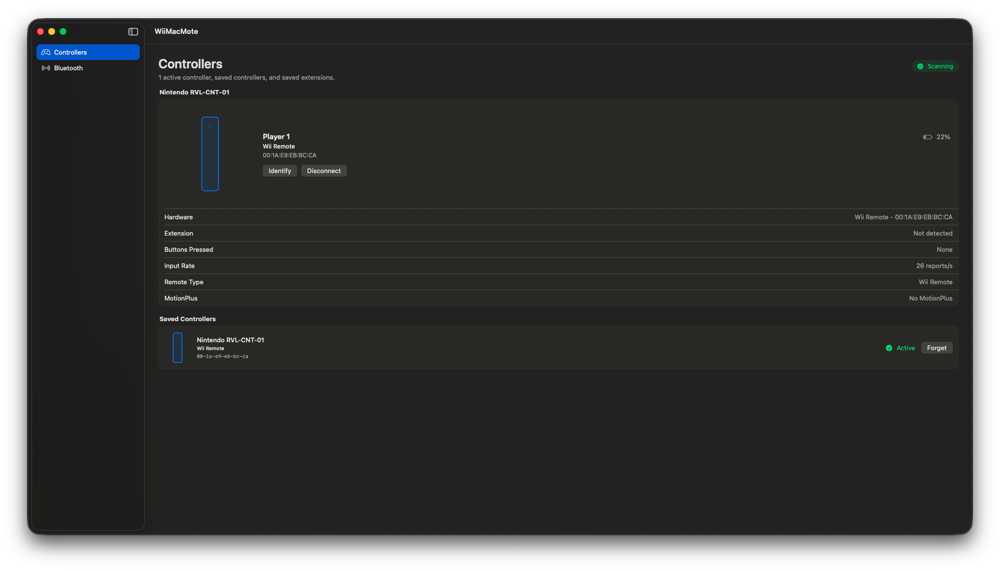

# WiiMacMote

WiiMacMote is a macOS utility for pairing Nintendo Wii controllers over Bluetooth.



## Features

- Pairs new Wii peripherals using the red SYNC button.
- Reconnects saved devices from macOS Bluetooth.
- Shows active controllers first, including buttons, battery, player LEDs, rumble, MotionPlus capability, and extension status.

## Requirements

- macOS 14 or newer.
- Xcode 16 or newer.
- Bluetooth-capable Mac.
- Nintendo Wii Remote, Wii Remote Plus, Wii Fit Balance Board, or compatible Wii extension.

## Build

- Open `WiiMacMote.xcodeproj`.
- Select the `WiiMacMote` scheme and `My Mac` destination.
- Build and run from Xcode.
- Or run `./Scripts/build.sh`.
- Run source checks with `./Scripts/verify-source.sh`.

Local copied apps may need fresh ad-hoc signing for macOS Bluetooth permission:

```sh
codesign --force --deep --sign - /Applications/WiiMacMote.app
```

You can also run:

```sh
./Scripts/build.sh --sign-installed
```

## Pairing

- Open the Bluetooth section.
- Turn on `Scan`.
- For a new Wii peripheral, press the red SYNC button behind the battery cover.
- For a saved Wii remote, press a face button such as `1` or `2` while scanning is on.
- For a saved Wii Fit Balance Board, press its power button while scanning is on.
- Connection can take a moment while macOS exposes the HID service.

## References

- https://github.com/wiiuse/wiiuse
